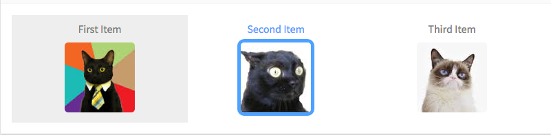

# Selector

Like a radio form-control, but with custom HTML elements



```jsx
const opts = [
  { img: '/img/pic1.jpg', label: 'First Item', value: 1 },
  { img: '/img/pic2.jpg', label: 'Second Item', value: 2 },
  { img: '/img/pic3.jpg', label: 'Third Item', value: 3 }
]
const onSelect = opt => this.setState({ current: opt.value })
<Selector options={opts} value={this.state.current} onSelect={onSelect} />
```

```jsx
const opts = [
  { el: <div><strong>First</strong> El</div>, value: 1 },
  { el: <div><strong>Second</strong> El</div>, value: 2 },
  { el: <div><strong>Third</strong> El</div>, value: 3 }
]
const onSelect = opt => this.setState({ current: opt.value })
<Selector options={opts} value={this.state.current} onSelect={onSelect} />
</div>
```